# Hospital Management System – MySQL

## Project Overview

The Hospital Management System is a database project developed using MySQL to manage and organize hospital-related information.

The project demonstrates relational database concepts, SQL queries, CRUD operations, joins, aggregate functions, GROUP BY, and database normalization.

## Technologies Used

- MySQL
- SQL
- MySQL Workbench

## Database Modules

- Patients
- Doctors
- Encounters
- Prescriptions
- Medications
- Diagnostic Tests
- Test Reports
- Procedures
- Emergency

## ER Diagram


## Database Tables

### 1. Database Tables Overview
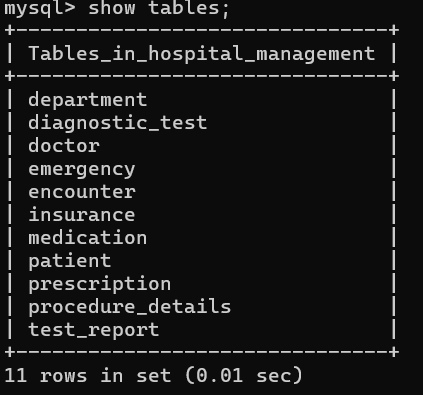

### 2. Department
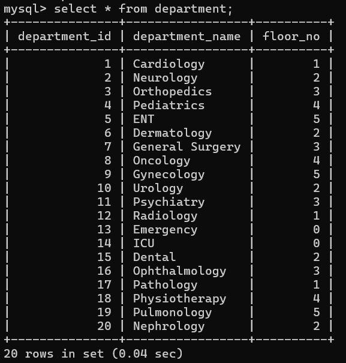

### 3. Diagnostic Test
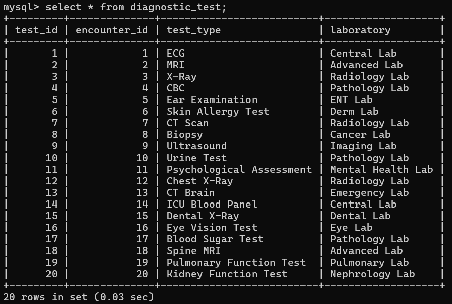

### 4. Doctors
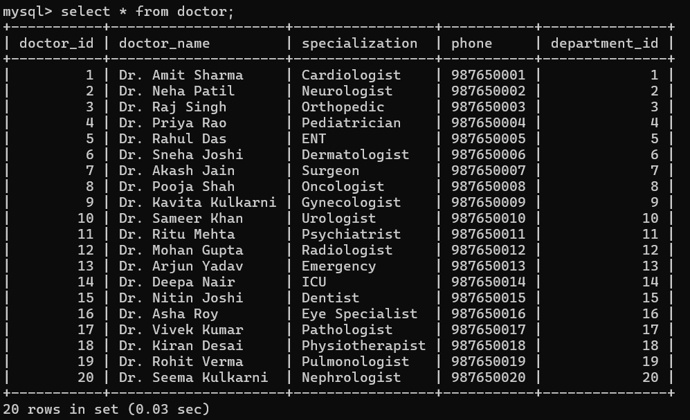

### 5. Emergency
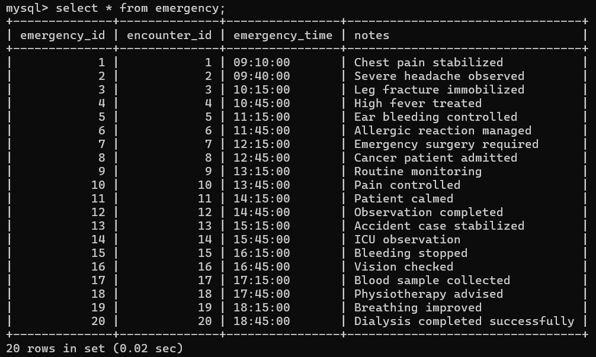

### 6. Encounters
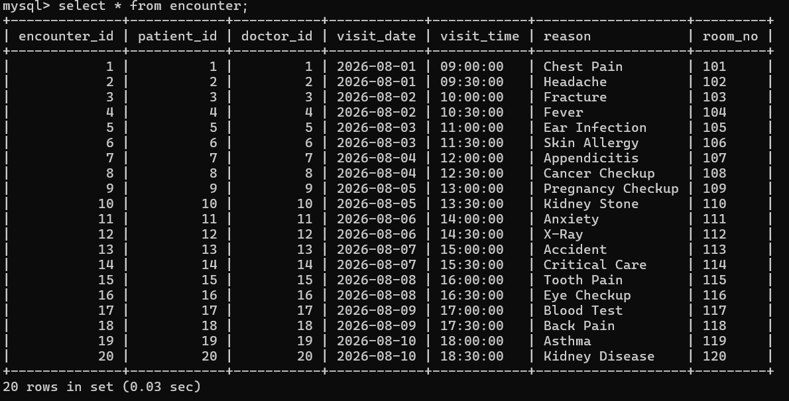

### 7. Insurance
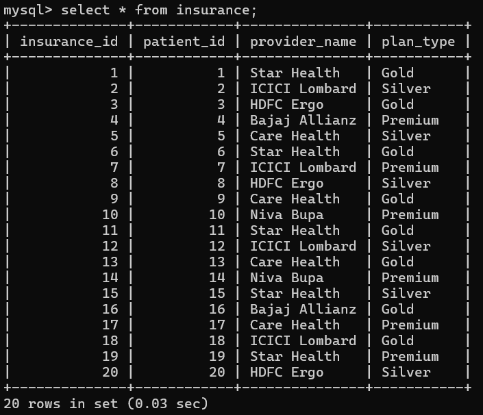

### 8. Medications
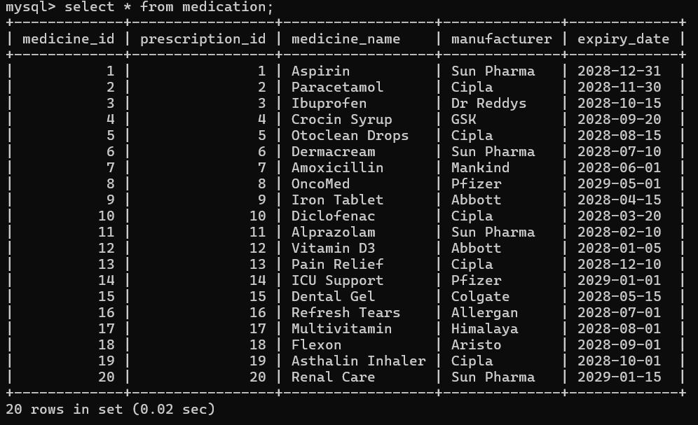

### 9. Patients
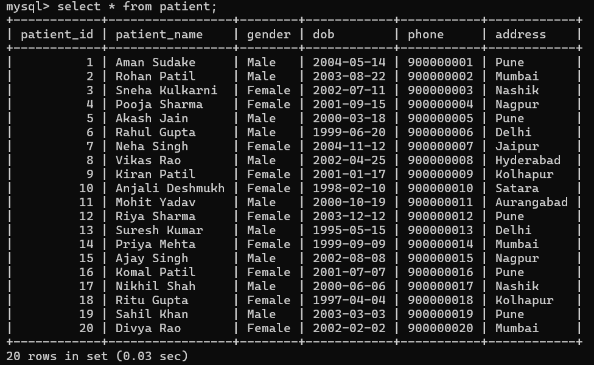

### 10. Prescriptions
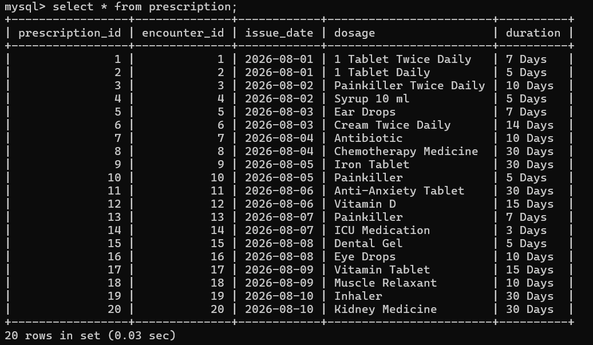

### 11. Procedure Details
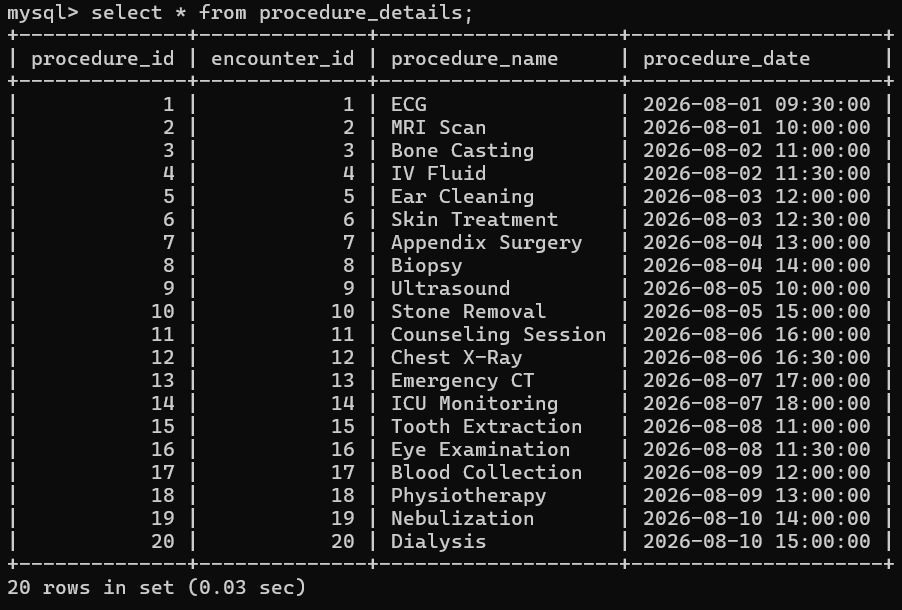

### 12. Test Report
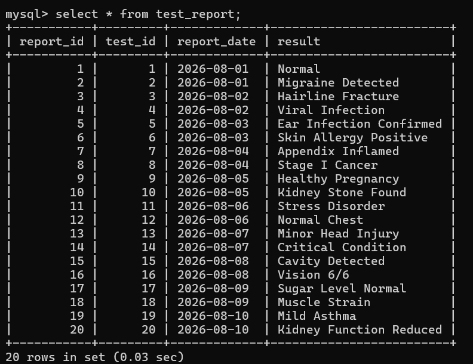

## SQL Concepts Used

- CREATE DATABASE
- CREATE TABLE
- INSERT
- SELECT
- UPDATE
- DELETE
- JOIN
- GROUP BY
- Aggregate Functions
- WHERE
- ORDER BY
- Database Normalization
- Primary Keys
- Foreign Keys
- Relationships

## Project Structure

```text
Hospital-Management-System-SQL/
│
├── README.md
├── SQL/
├── ER-Diagram/
└── Screenshots/
